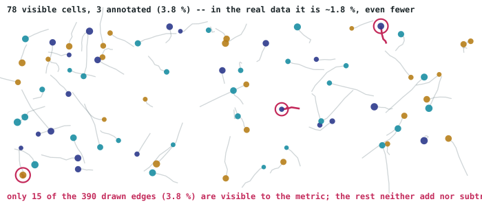
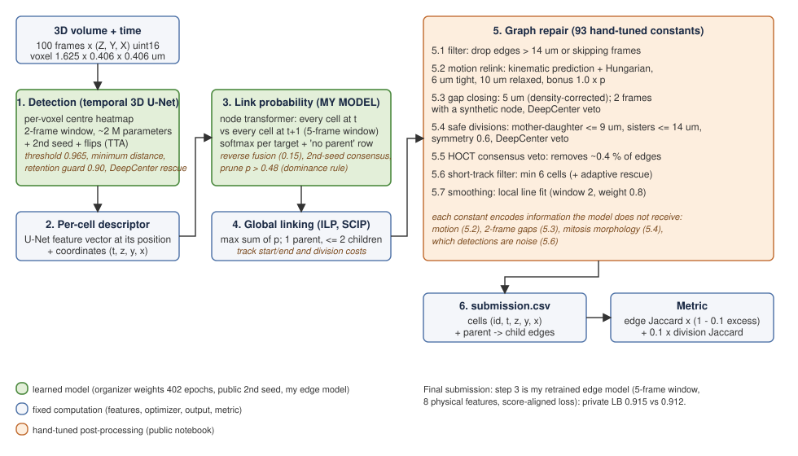

# Cell tracking in 3D+time light-sheet microscopy

My solution and research log for the Kaggle competition
[Biohub – Cell Tracking During Development](https://www.kaggle.com/competitions/biohub-cell-tracking-during-development)
(CZ Biohub / Royer Lab): reconstruct cell lineages (detection, frame-to-frame linking and divisions) from 3D+time
fluorescence volumes of developing embryos.

**Final result: 0.915 on the private leaderboard**, above the strongest public notebook (0.947 public → 0.912 private).
The final submission is the best public pipeline with its edge model replaced by a model I retrained (5-frame temporal
window, physically motivated input features, a loss aligned with the competition score).

| submission | public LB | private LB |
|---|---|---|
| strongest public notebook (reproduced) | **0.947** | 0.912 |
| **public pipeline + my window-5 edge model (selected)** | 0.940 | **0.915** |
| public pipeline + averaged edges (theirs + my two models) | 0.940 | **0.916** |
| my model alone, no hand-tuned post-processing | 0.875 | 0.848 |
| my first transductive per-crop pipeline + Kalman linker | 0.689 | — |

The public score ranked these the other way round. Choosing the final submissions by the offline bench instead of the
4-video public leaderboard was worth +0.003 on the private split (automatic top-2 selection would have scored 0.912).

## The problem



- **Data:** 199 training + 4 test videos, OME-Zarr v3 `(T, Z, Y, X)` uint16, anisotropic voxels (1.625 × 0.406 × 0.406 µm),
  ~87 GB zipped. Everything is read by streaming chunks straight from the zip (`cellmot.io`); nothing is decompressed.
- **Annotation is sparse:** only ~2 % of cells have ground-truth tracks. Edges not touching an annotated cell are invisible
  to the metric.
- **Metric:** `J · (1 − 0.1 · (N_pred − N_total)/N_total) + 0.1 · J_div`, with one-to-one centroid matching at ≤ 7 µm.
  Emitting more nodes than the (hidden) census is penalised without a cap; divisions are worth up to 0.1.

## Pipeline



1. **Detection:** temporal 3D U-Net centre heatmap (organizer's weights + a second public seed, flip TTA).
2. **Edge probabilities:** a node transformer scores every cell at *t* against every cell at *t+1*. **This is the piece
   I replaced** with my retrained model (`kaggle/w5_edges.py`): a 5-frame window around each pair instead of 2,
   8 physical feature maps per cell (local brightness, contrast, peakedness, temporal intensity change and a local motion estimate), a "no parent" row, and a differentiable
   surrogate of the competition score as the loss (`cellmot/score_loss.py`: exact false-positive rule, optimal one-to-one
   matching at 7 µm, uncapped count factor, division term).
3. **Global linking:** integer linear program (at most one parent, two children).
4. **Graph repair** (public notebook): motion relinking, gap closing, division rules, short-track pruning, HOCT consensus veto.

## What is in this repository

| path | what |
|---|---|
| `src/cellmot/io.py` | streaming reader for the zipped OME-Zarr / GEFF data |
| `src/cellmot/official/` | the official competition metric (organizers' code, vendored for offline scoring) |
| `src/cellmot/evaluate.py` | helpers to build prediction graphs and score them locally |
| `src/cellmot/score_loss.py` | score-aligned loss, physical features and decoder of my model |
| `training/` | patches applied to the organizer's training script: seed control, fp16 (2.35× faster on T4), score loss |
| `kaggle/w5_edges.py` | injects my model's edge logits into the public notebook's prediction loop |
| `kaggle/build_submission_w5.py` | builds the final submission notebook from the public one |
| `kaggle/build_validator_kernel.py` | runs the public notebook's own validator on chosen training crops and dumps raw graphs |
| `bench/` | the *faithful bench*: re-runs the notebook's graph repair on those raw graphs with any constant changed |
| `tests/` | metric, IO and loss tests on synthetic data (no competition data needed) |
| `docs/WRITEUP.md` | the full story: what worked, what did not, why, and what was missing compared with the 3rd-place solution |

The public notebook and the organizer's model code are third-party and are **not** redistributed here; the builders
take them as inputs. Competition data and model weights are not included.

## Engineering practices worth pointing out

- **Metric first.** The official metric runs locally and is unit-tested (perfect prediction = 1, matching gate,
  count penalty); every experiment is scored with it on full ground truth.
- **Pre-registered predictions.** Each leaderboard submission was logged with its expected score before the result; misses
  were written up (e.g. predicted 0.937, got 0.930).
- **Instrument validation.** Four offline benches were built and each was checked against the leaderboard. The last one
  runs the public notebook itself on held-out training crops; it transfers for detection and divisions, not for edge
  choice (sparse training annotation contains identity jumps). See `docs/WRITEUP.md`.
- **Reproducible GPU work.** Kaggle T4 ×2 used with one process per GPU; fail-fast capability checks; every kernel reads
  its inputs by glob rather than hard-coded mount paths.
- **Minimum effect size.** Two identical training runs differ by ±0.002, so nothing below ±0.005 was treated as signal.

## Setup

```bash
pip install -e ".[dev]"
pytest
```

Scoring against real data needs the competition zip (`--zip path/to/biohub-cell-tracking-during-development.zip`).

Typical workflow (the public notebook and the organizer's repository are downloaded separately):

```bash
# 1. patch the organizer's training script (seed control, fp16, score-aligned loss) and train
python training/patch_seed.py  path/to/kaggle-cell-tracking-competition
python training/patch_fp16.py  path/to/kaggle-cell-tracking-competition
python training/patch_score.py path/to/kaggle-cell-tracking-competition

# 2. dump the public notebook's raw graphs on held-out training crops (Kaggle GPU kernel)
python kaggle/build_validator_kernel.py --base-notebook public.ipynb --base-metadata kernel-metadata.json --dids <crop ids>

# 3. re-run the notebook's graph repair with changed constants, scored on full ground truth
BIOHUB_PUBLIC_MODULE=path/to/public_module.py python bench/faithful_bench.py --zip data.zip --raw raw_graphs/

# 4. build the final submission notebook (public pipeline + window-5 edges)
python kaggle/build_submission_w5.py --base-notebook public.ipynb --base-metadata kernel-metadata.json
```

## Credits

Organizers' baseline model and metric: CZ Biohub / Royer Lab. Public pipeline: Kaggle notebooks by evgendvorkin,
analyticaobscura and sjlee101 (HOCT veto), which the final submission forks.

## License

MIT (my code). The vendored metric keeps its original authorship.
